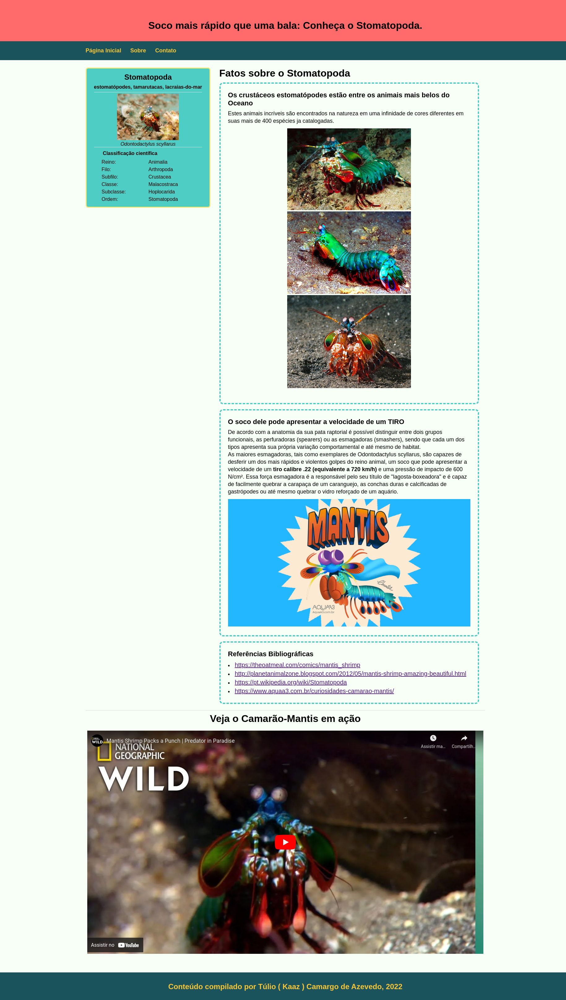

# HTML Semântico

Com a execução deste exercício educacional pretendo ser capaz de:

- Fazer uso de elementos HTML de acordo com o sentido e o propósito que eles carregam.
Tais elementos incluem, mas não se limitam a: header, nav, aside, article, section,
footer e img;

- Criar páginas semanticamente válidas e acessíveis;

- Entender a diferença entre elementos de bloco e elementos inline.

## ScreenShot da Página

